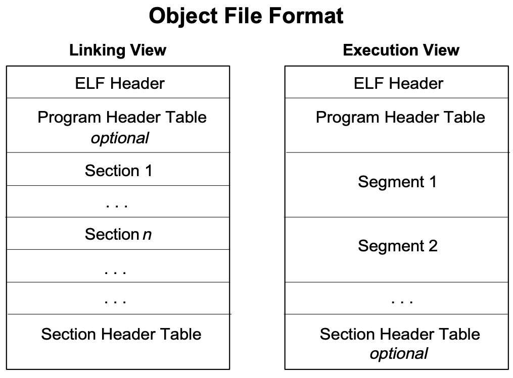

# ELF

* `ELF`=`Executable and Linking Format`=`可执行和链接格式`
  * 按类型分
    * `Relocatable File`=`可重定位文件`
      *  A relocatable file holds code and data suitable for linking with other object files to create an executable or a shared object file.
    * `Executable File`=`可执行文件`
      * An executable file holds a program suitable for execution
    * `Shared Object File`=`共享对象文件`
      * A shared object file holds code and data suitable for linking in two contexts. First, the link editor may process it with other relocatable and shared object files to create another object file. 
      * Second, the dynamic linker combines it with an executable file and other shared objects to create a process image
  * ELF格式概览
    * 图
      * 
