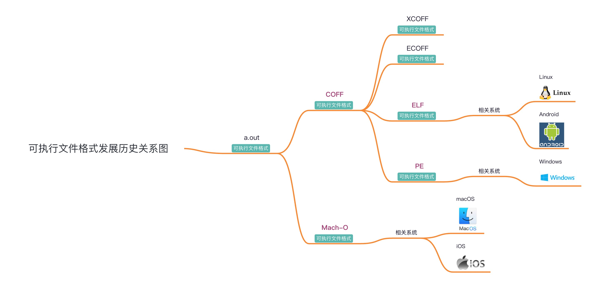

# 可执行文件格式概览

可执行文件格式，常见的有很多种。

此处只至少其中相对常见的：

## 背景知识

### 文件后缀和格式

* 文件后缀和格式
  * 库文件
    * 动态库文件
      * Win: `.dll`
      * Linux/Android: `.so`
        * 相关：目标文件：`.o`
      * Mac: `.dylib`
    * 静态库文件
      * Win: `.lib`
      * Linux: `.a`
      * Mac: `.a`
  * 可执行文件
    * Win:.exe
    * Linux/Android: 无后缀
    * Mac:.app 或 无后缀

## 可执行文件格式和文件后缀

* 可执行文件格式和文件后缀
  * 可执行文件格式发展历史关系图
    * 离线查看
      * 
    * 在线浏览
      * [可执行文件格式发展历史关系图| ProcessOn免费在线作图](https://www.processon.com/view/link/6509b53ff0cd331ec289d299)
  * 概述
    * 早期的：`a.out`、通用的`COFF`
    * 目前主流的：
      * `Win`：`PE`
        * 相关文件：`.exe`可执行文件、`.dll`动态库
      * `Linux`和`Android`：`ELF`
        * 相关文件：`无后缀`可执行文件、`.so`动态库、`.o`目标文件
      * `macOS`/`iOS`：`Mach-O`
        * 相关文件：`无后缀`可执行文件、`.dylib`动态库、`.o`目标文件
  * 详解
    * 早期的
      * Microsoft
        * `MZ`：`DOS`中的`.exe`
          * `MZ`=`Mark Zbikowski`：MS-DOS主要开发者之一
      * UNIX系统
        * 最早的
          * `a.out`
            * =`assembler output`
        * 后来通用的
          * `COFF`
    * 目前主流的
      * Microsoft系的：`PE`
        * 常见系统：`Windows`
        * 常见后缀：`.exe`
          * 相关的：动态链接库的`.dll`
      * Linux系的：`ELF`
        * 常见系统：`Linux`各个发行版（`Ubuntu`、`CentOS`等）、（基于Linux改造的）`Android`
        * 常见后缀：`无`
          * 相关的：动态链接库的`.so`、目标文件的`.o`
      * Apple系的：`Mach-O`
        * 常见系统：`macOS`/`iOS`/`watchOS`/`tvOS`
        * 常见后缀：`无`
          * 相关的：动态链接库的`.dylib`
