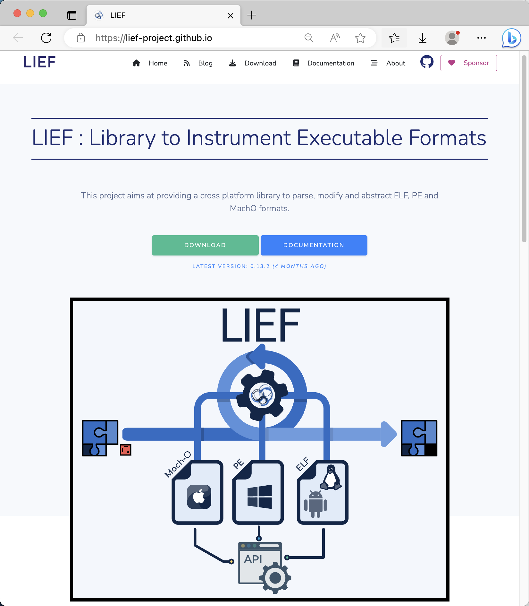

# LIEF

* `LIEF`
  * 介绍：用于查看和解析（`ELF`/`MachO`/`PE`/`Android`等）各种通用的可执行文件格式的库
  * 一句话描述：Library to Instrument Executable Formats
  * 支持格式
    * `ELF`
    * `PE`
    * `MachO`
    * `Android`
      * `DEX`
      * `OAT`
      * `ART`
      * `VDEX`
  * 主页
    * [LIEF](https://lief-project.github.io/)
      * 图
        * 
      * 文档
        * [Welcome to LIEF’s documentation! — LIEF Documentation](https://lief-project.github.io//doc/latest/)
      * 下载
        * [LIEF](https://lief-project.github.io/download/)

## 安装

* Mac
  ```bash
  pip install lief
  ```
