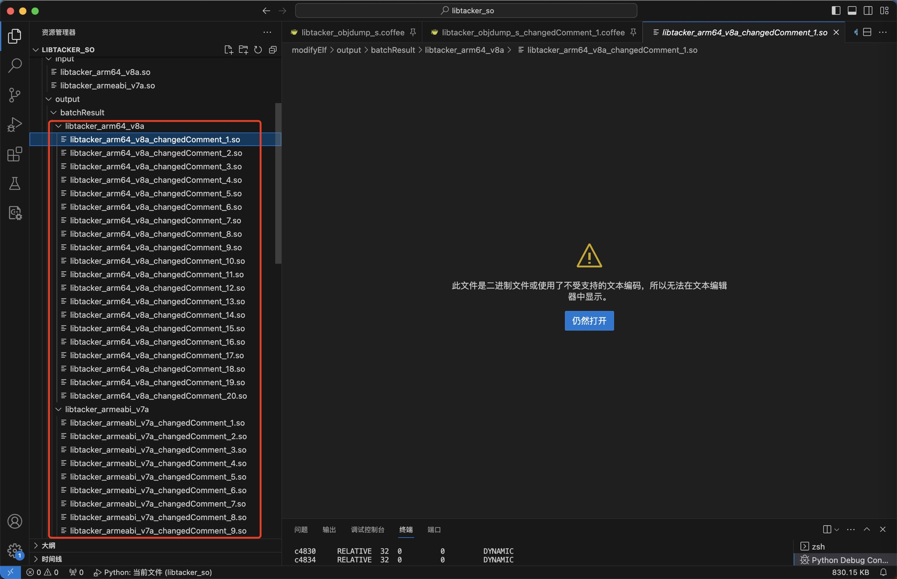
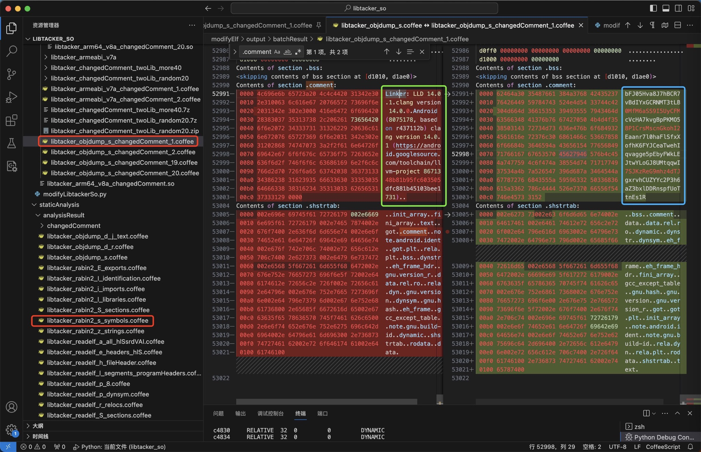

# LIEF修改ELF的libtacker.so

此处举例说明LIEF的用法：

* 用LIEF解析修改ELF格式的so库文件：`libtacker.so`

## 基本用法：打印解析后对象的信息

代码：

```py
import lief

libtackerObj = lief.parse('modifyElf/input/libtacker_arm64_v8a.so')
print("libtackerObj=", libtackerObj)
```

输出：

```bash
➜  libtacker_so python modifyElf/modifyLibtackerSo.py
intputElfFile= modifyElf/input/libtacker_armeabi_v7a.so
inputFileName= libtacker_armeabi_v7a.so
pureFileName=%s, fileExt=%s ('libtacker_armeabi_v7a', '.so')
Loaded file:  modifyElf/input/libtacker_armeabi_v7a.so
libtackerElf= Header
======
Magic:                           7f 45 4c 46
Class:                           CLASS32
Endianness:                      LSB
Version:                         CURRENT
OS/ABI:                          SYSTEMV
ABI Version:                     0
Machine type:                    ARM
File type:                       DYNAMIC
Object file version:             CURRENT
Entry Point:                     0xb9c8
Program header offset:           0x34
Section header offset:           815008
Processor Flag:                  83886592 SOFT_FLOAT EABI_VER5
Header size:                     52
Size of program header:          32
Number of program header:        9
Size of section header:          40
Number of section headers:       27
Section Name Table idx:          26

Sections
========
                    NULL           0         0         0         0
.note.android.ident NOTE           154       98        154       1.09412   ALLOC                         LOAD NOTE
.note.gnu.build-id  NOTE           1ec       24        1ec       4.13606   ALLOC                         LOAD NOTE
.dynsym             DYNSYM         210       6d0       210       3.54702   ALLOC                         LOAD
.gnu.version        HIOS           8e0       da        8e0       1.48975   ALLOC                         LOAD
.gnu.version_r      GNU_VERNEED    9bc       40        9bc       2.16157   ALLOC                         LOAD
.gnu.hash           GNU_HASH       9fc       1ec       9fc       6.3602    ALLOC                         LOAD
.hash               HASH           be8       370       be8       1.38896   ALLOC                         LOAD
.dynstr             STRTAB         f58       b8f       f58       4.66594   ALLOC                         LOAD
.rel.dyn            REL            1ae8      2dd0      1ae8      3.36673   ALLOC                         LOAD
.ARM.exidx          ARM_EXIDX      48b8      1ad8      48b8      5.18866   ALLOC LINK_ORDER              LOAD ARM_UNWIND
.rel.plt            REL            6390      120       6390      3.54485   ALLOC INFO_LINK               LOAD
.ARM.extab          PROGBITS       64b0      334c      64b0      4.80098   ALLOC                         LOAD
.rodata             PROGBITS       97fc      21c7      97fc      5.26982   ALLOC MERGE STRINGS           LOAD
.text               PROGBITS       b9c8      b72c4     b9c8      6.55022   ALLOC EXECINSTR               LOAD
.plt                PROGBITS       c2c90     260       c2c90     3.78829   ALLOC EXECINSTR               LOAD
.data.rel.ro        PROGBITS       c3ef0     1790      c2ef0     4.42226   WRITE ALLOC                   LOAD GNU_RELRO
.fini_array         FINI_ARRAY     c5680     8         c4680     1.75      WRITE ALLOC                   LOAD GNU_RELRO
.init_array         INIT_ARRAY     c5688     114       c4688     -0        WRITE ALLOC                   LOAD GNU_RELRO
.dynamic            DYNAMIC        c579c     e8        c479c     3.17459   WRITE ALLOC                   LOAD DYNAMIC GNU_RELRO
.got                PROGBITS       c5884     70        c4884     3.63662   WRITE ALLOC                   LOAD GNU_RELRO
.got.plt            PROGBITS       c58f4     9c        c48f4     1.98777   WRITE ALLOC                   LOAD GNU_RELRO
.data               PROGBITS       c6990     2410      c4990     7.22773   WRITE ALLOC                   LOAD
.bss                NOBITS         c8da0     22d       c6da0     5.11609   WRITE ALLOC                   LOAD
.comment            PROGBITS       0         c6        c6da0     5.05236   MERGE STRINGS
.ARM.attributes     ARM_ATTRIBUTES 0         3c        c6e66     4.587
.shstrtab           STRTAB         0         fe        c6ea2     4.2632

Segments
========
PHDR              r--       34        34        34        120       120       4

LOAD              r-x       0         0         0         c2ef0     c2ef0     1000
Sections in this segment :
	.note.android.ident
	.note.gnu.build-id
	.dynsym
	.gnu.version
	.gnu.version_r
	.gnu.hash
	.hash
	.dynstr
	.rel.dyn
	.ARM.exidx
	.rel.plt
	.ARM.extab
	.rodata
	.text
	.plt

LOAD              rw-       c2ef0     c3ef0     c3ef0     1aa0      1aa0      1000
Sections in this segment :
	.data.rel.ro
	.fini_array
	.init_array
	.dynamic
	.got
	.got.plt

LOAD              rw-       c4990     c6990     c6990     2410      263d      1000
Sections in this segment :
	.data
	.bss

DYNAMIC           rw-       c479c     c579c     c579c     e8        e8        4
Sections in this segment :
	.dynamic

GNU_RELRO         r--       c2ef0     c3ef0     c3ef0     1aa0      2110      1
Sections in this segment :
	.data.rel.ro
	.fini_array
	.init_array
	.dynamic
	.got
	.got.plt

GNU_STACK         rw-       0         0         0         0         0         0

NOTE              r--       154       154       154       bc        bc        4
Sections in this segment :
	.note.android.ident
	.note.gnu.build-id

ARM_UNWIND        r--       48b8      48b8      48b8      1ad8      1ad8      4
Sections in this segment :
	.ARM.exidx


Dynamic entries
===============
NEEDED              b71       liblog.so
NEEDED              b7b       libm.so
NEEDED              b5b       libdl.so
NEEDED              b69       libc.so
SONAME              b83       libforce.so
FLAGS               8          BIND_NOW
FLAGS_1             1          NOW
REL                 1ae8
RELSZ               2dd0
RELENT              8
RELCOUNT            573
JMPREL              6390
PLTRELSZ            120
PLTGOT              c58f4
PLTREL              11
SYMTAB              210
SYMENT              10
STRTAB              f58
STRSZ               b8f
GNU_HASH            9fc
HASH                be8
INIT_ARRAY          c5688     [0x0, 0x0, 0x0, 0x0, 0x0, 0x0, 0x0, 0x0, 0x0, 0x0, 0x0, 0x0, 0x0, 0x0, 0x0, 0x0, 0x0, 0x0, 0x0, 0x0, 0x0, 0x0, 0x0, 0x0, 0x0, 0x0, 0x0, 0x0, 0x0, 0x0, 0x0, 0x0, 0x0, 0x0, 0x0, 0x0, 0x0, 0x0, 0x0, 0x0, 0x0, 0x0, 0x0, 0x0, 0x0, 0x0, 0x0, 0x0, 0x0, 0x0, 0x0, 0x0, 0x0, 0x0, 0x0, 0x0, 0x0, 0x0, 0x0, 0x0, 0x0, 0x0, 0x0, 0x0, 0x0, 0x0, 0x0, 0x0, 0x0]
INIT_ARRAYSZ        114
FINI_ARRAY          c5680     [0xb9dc, 0xb9c8]
FINI_ARRAYSZ        8
VERSYM              8e0
VERNEED             9bc
VERNEEDNUM          2
NULL                0

Dynamic symbols
===============
                              NOTYPE    LOCAL     0         0         * Local *
__cxa_finalize                FUNC      GLOBAL    0         0         LIBC      (2)
__cxa_atexit                  FUNC      GLOBAL    0         0         LIBC      (2)
__android_log_print           FUNC      GLOBAL    0         0         * Global *
__stack_chk_fail              FUNC      GLOBAL    0         0         LIBC      (2)
__stack_chk_guard             OBJECT    GLOBAL    0         0         LIBC      (2)
__strncpy_chk2                FUNC      GLOBAL    0         0         LIBC      (2)
strncpy                       FUNC      GLOBAL    0         0         LIBC      (2)
strncat                       FUNC      GLOBAL    0         0         LIBC      (2)
pthread_self                  FUNC      GLOBAL    0         0         LIBC      (2)
malloc                        FUNC      GLOBAL    0         0         LIBC      (2)
free                          FUNC      GLOBAL    0         0         LIBC      (2)
posix_memalign                FUNC      GLOBAL    0         0         LIBC      (2)
abort                         FUNC      GLOBAL    0         0         LIBC      (2)
vfprintf                      FUNC      GLOBAL    0         0         LIBC      (2)
fputc                         FUNC      GLOBAL    0         0         LIBC      (2)
vasprintf                     FUNC      GLOBAL    0         0         LIBC      (2)
__assert2                     FUNC      GLOBAL    0         0         LIBC      (2)
__sF                          OBJECT    GLOBAL    0         0         LIBC      (2)
strlen                        FUNC      GLOBAL    0         0         LIBC      (2)
realloc                       FUNC      GLOBAL    0         0         LIBC      (2)
__strlen_chk                  FUNC      GLOBAL    0         0         LIBC      (2)
memchr                        FUNC      GLOBAL    0         0         LIBC      (2)
__vsnprintf_chk               FUNC      GLOBAL    0         0         LIBC      (2)
pthread_mutex_lock            FUNC      GLOBAL    0         0         LIBC      (2)
calloc                        FUNC      GLOBAL    0         0         LIBC      (2)
pthread_mutex_unlock          FUNC      GLOBAL    0         0         LIBC      (2)
strcmp                        FUNC      GLOBAL    0         0         LIBC      (2)
pthread_getspecific           FUNC      GLOBAL    0         0         LIBC      (2)
memset                        FUNC      GLOBAL    0         0         LIBC      (2)
pthread_once                  FUNC      GLOBAL    0         0         LIBC      (2)
pthread_setspecific           FUNC      GLOBAL    0         0         LIBC      (2)
memcpy                        FUNC      GLOBAL    0         0         LIBC      (2)
pthread_key_delete            FUNC      GLOBAL    0         0         LIBC      (2)
pthread_key_create            FUNC      GLOBAL    0         0         LIBC      (2)
memmove                       FUNC      GLOBAL    0         0         LIBC      (2)
fprintf                       FUNC      GLOBAL    0         0         LIBC      (2)
fflush                        FUNC      GLOBAL    0         0         LIBC      (2)
dl_unwind_find_exidx          FUNC      GLOBAL    0         0         LIBC      (3)
.datadiv_decode8345671930506918460FUNC      GLOBAL    28ec9     2384      * Global *
.datadiv_decode17898716361002246085FUNC      GLOBAL    69a59     eee       * Global *
...
.datadiv_decode18430821605022316503FUNC      GLOBAL    9c47d     1044      * Global *
JNI_OnLoad                    FUNC      GLOBAL    b2bcd     48c       * Global *
.datadiv_decode9810505568447265400FUNC      GLOBAL    18c81     33e8      * Global *
...
.datadiv_decode3623259086264565478FUNC      GLOBAL    89201     8e6       * Global *

Static symbols
==============

Symbol versions
===============
* Local *
LIBC(2)
LIBC(2)
* Global *
LIBC(2)
LIBC(2)
...
LIBC(2)
LIBC(3)
* Global *
...
* Global *

Symbol versions definition
==========================

Symbol version requirement
==========================
1 libdl.so
1 libc.so

Dynamic relocations
===================
c3ef0     RELATIVE  32  0         0         DYNAMIC
c3ef4     RELATIVE  32  0         0         DYNAMIC
c3ef8     RELATIVE  32  0         0         DYNAMIC
...
c8d9c     RELATIVE  32  0         0         DYNAMIC
c5884     GLOB_DAT  32  0         5         DYNAMIC   __stack_chk_guard
c58a8     GLOB_DAT  32  0         12        DYNAMIC   __sF
c56ac     ABS32     32  0         27        DYNAMIC   .datadiv_decode8345671930506918460
c56fc     ABS32     32  0         28        DYNAMIC   .datadiv_decode17898716361002246085
c573c     ABS32     32  0         29        DYNAMIC   .datadiv_decode1857239248186750646
...
c5738     ABS32     32  0         6c        DYNAMIC   .datadiv_decode3623259086264565478

.plt.got relocations
====================
c5900     JUMP_SLOT 32  0         1         PLTGOT    __cxa_finalize
c5904     JUMP_SLOT 32  0         2         PLTGOT    __cxa_atexit
c5908     JUMP_SLOT 32  0         3         PLTGOT    __android_log_print
c590c     JUMP_SLOT 32  0         4         PLTGOT    __stack_chk_fail
c5910     JUMP_SLOT 32  0         6         PLTGOT    __strncpy_chk2
c5914     JUMP_SLOT 32  0         7         PLTGOT    strncpy
c5918     JUMP_SLOT 32  0         8         PLTGOT    strncat
c591c     JUMP_SLOT 32  0         9         PLTGOT    pthread_self
c5920     JUMP_SLOT 32  0         a         PLTGOT    malloc
c5924     JUMP_SLOT 32  0         b         PLTGOT    free
c5928     JUMP_SLOT 32  0         c         PLTGOT    posix_memalign
c592c     JUMP_SLOT 32  0         d         PLTGOT    abort
c5930     JUMP_SLOT 32  0         e         PLTGOT    vfprintf
c5934     JUMP_SLOT 32  0         f         PLTGOT    fputc
c5938     JUMP_SLOT 32  0         10        PLTGOT    vasprintf
c593c     JUMP_SLOT 32  0         11        PLTGOT    __assert2
c5940     JUMP_SLOT 32  0         13        PLTGOT    strlen
c5944     JUMP_SLOT 32  0         14        PLTGOT    realloc
c5948     JUMP_SLOT 32  0         15        PLTGOT    __strlen_chk
c594c     JUMP_SLOT 32  0         16        PLTGOT    memchr
c5950     JUMP_SLOT 32  0         17        PLTGOT    __vsnprintf_chk
c5954     JUMP_SLOT 32  0         18        PLTGOT    pthread_mutex_lock
c5958     JUMP_SLOT 32  0         19        PLTGOT    calloc
c595c     JUMP_SLOT 32  0         1a        PLTGOT    pthread_mutex_unlock
c5960     JUMP_SLOT 32  0         1b        PLTGOT    strcmp
c5964     JUMP_SLOT 32  0         1c        PLTGOT    pthread_getspecific
c5968     JUMP_SLOT 32  0         1d        PLTGOT    memset
c596c     JUMP_SLOT 32  0         1e        PLTGOT    pthread_once
c5970     JUMP_SLOT 32  0         1f        PLTGOT    pthread_setspecific
c5974     JUMP_SLOT 32  0         20        PLTGOT    memcpy
c5978     JUMP_SLOT 32  0         21        PLTGOT    pthread_key_delete
c597c     JUMP_SLOT 32  0         22        PLTGOT    pthread_key_create
c5980     JUMP_SLOT 32  0         23        PLTGOT    memmove
c5984     JUMP_SLOT 32  0         24        PLTGOT    fprintf
c5988     JUMP_SLOT 32  0         25        PLTGOT    fflush
c598c     JUMP_SLOT 32  0         26        PLTGOT    dl_unwind_find_exidx

Notes
=====
Note #0
-------
Name:                            Android
Type:                            ABI_TAG
Description:                     [15 00 00 00 72 32 34 00 00 00 00 00 00 00 00 00 ...]

Note #1
-------
Name:                            GNU
Type:                            BUILD_ID
Description:                     [fa 8a 30 55 6b db 44 9a 4a 2f 1f 83 46 6d 93 44 ...]
ID Hash:                         fa8a30556bdb449a4a2f1f83466d9344fdef3fb5


GNU Hash Table
==============
0x6000022d2e80

SYSV Hash Table
===============
0x600001381b40
```

## 复杂用法：修改`.comment`内容为随机乱码

代码：

* `modifyElf/modifyLibtackerSo.py`

```py
# Function: mofidy libtacker so (arm64_v8a, armeabi_v7a) comments section content the output to new one
# Author: Crifan Li
# Update: 20230912

import os
import random
import string
import lief

################################################################################
# input & config
################################################################################

# intputElfFile = "modifyElf/input/libtacker_arm64_v8a.so"
intputElfFile = "modifyElf/input/libtacker_armeabi_v7a.so"
print("intputElfFile=", intputElfFile)

outputFoler = "modifyElf/output"

TotalRandomTime = 40
OutputSuffixStartNum = 20

################################################################################
# generate output file name
################################################################################

inputFileName = os.path.basename(intputElfFile)
print("inputFileName=", inputFileName)
pureFileName, fileExt = os.path.splitext(inputFileName)
print("pureFileName=%s, fileExt=%s", (pureFileName, fileExt)) # pureFileName=%s, fileExt=%s ('libtacker_arm64_v8a', '.so')

################################################################################
# Main
################################################################################

libtackerElf = lief.parse(intputElfFile)
print("Loaded file: ", intputElfFile)
# print("libtackerElf=", libtackerElf)
print("header=", libtackerElf.header)
print("imported_functions=", libtackerElf.imported_functions)
print("exported_functions=", libtackerElf.exported_functions)

for section in libtackerElf.sections:
  print("-"*20) # section's name
  print("name=", section.name) # section's name
  print("size=", section.size) # section's size
  contentLen = len(section.content)
  print("contentLen=", contentLen) # Should match the previous print

commentSection = libtackerElf.get_section(".comment")

print("\n\n")


print("+++ Start total %d round overwrite .comment section content with random char" % TotalRandomTime)

ContentCharNum = commentSection.size
print("ContentCharNum=", ContentCharNum)

RamdonCharRange = string.ascii_letters + string.digits
print("RamdonCharRange=", RamdonCharRange)

for curRandomTimeIdx in range(TotalRandomTime):
  curRandomTime = curRandomTimeIdx + 1
  print("%s Random Time [%d] %s" % ("-"*30, curRandomTime, "-"*30))

  # randomCharList = random.sample(RamdonCharRange, 198)

  randomCharList = []
  for randomCharIdx in range(ContentCharNum):
    curRandomChar = random.choice(RamdonCharRange)
    randomCharList.append(curRandomChar)
  print("randomCharList=", randomCharList)

  # randomCharBytes = bytes(randomCharList)
  randomStr = "".join(randomCharList)
  print("randomStr=", randomStr)
  randomCharBytes = bytes(randomStr, "utf-8")
  print("randomCharBytes=", randomCharBytes)
  newContentBytes = randomCharBytes

  print("before: commentSection.content=", commentSection.content)

  # num0 = 0x30
  # print("commentSection contentType=", type(commentSection.content))
  # newContentBytes = bytes([num0] * commentSection.size)

  newContentMemoryView = memoryview(newContentBytes)
  # print("newContentMemoryView type=", type(newContentMemoryView))
  commentSection.content = newContentMemoryView
  print("after: commentSection.content=", commentSection.content)

  # outputElfFile = "modifyElf/output/libtacker_arm64_v8a_changedComment.so"
  # outputElfFile = "modifyElf/output/libtacker_arm64_v8a_changedComment_%d.so" % curRandomTime
  suffixNum = OutputSuffixStartNum + curRandomTime
  outputFileName = "%s_changedComment_%d%s" % (pureFileName, suffixNum, fileExt)
  outputElfFile = os.path.join(outputFoler, outputFileName)

  libtackerElf.write(outputElfFile)
  print("Saved to", outputElfFile)
```


* 输出log日志

```bash
Loaded file:  modifyElf/input/libtacker_arm64_v8a.so
header= Magic:                           7f 45 4c 46 
Class:                           CLASS64
Endianness:                      LSB
Version:                         CURRENT
OS/ABI:                          SYSTEMV
ABI Version:                     0
Machine type:                    AARCH64
File type:                       DYNAMIC
Object file version:             CURRENT
Entry Point:                     0x1a5c0
Program header offset:           0x40
Section header offset:           848344
Processor Flag:                  0 
Header size:                     64
Size of program header:          56
Number of program header:        9
Size of section header:          64
Number of section headers:       27
Section Name Table idx:          26


imported_functions= [<lief._lief.Function object at 0x104876f70>, <lief._lief.Function object at 0x104877230>, <lief._lief.Function object at 0x104877370>, <lief._lief.Function object at 0x1048772f0>, <lief._lief.Function object at 0x1048a99b0>, <lief._lief.Function object at 0x104967230>, <lief._lief.Function object at 0x1049668f0>, <lief._lief.Function object at 0x10487cc30>, <lief._lief.Function object at 0x10487cbb0>, <lief._lief.Function object at 0x10487cc70>, <lief._lief.Function object at 0x10487ccf0>, <lief._lief.Function object at 0x10487ccb0>, <lief._lief.Function object at 0x10497a7f0>, <lief._lief.Function object at 0x104a45bf0>, <lief._lief.Function object at 0x104a47c30>, <lief._lief.Function object at 0x104a474b0>, <lief._lief.Function object at 0x104a44470>, <lief._lief.Function object at 0x1049fd8b0>, <lief._lief.Function object at 0x1049fcab0>, <lief._lief.Function object at 0x104a7d6f0>, <lief._lief.Function object at 0x104a7ffb0>, <lief._lief.Function object at 0x104a7fbf0>, <lief._lief.Function object at 0x104a7fb70>, <lief._lief.Function object at 0x104a7ebb0>, <lief._lief.Function object at 0x104a7f5b0>, <lief._lief.Function object at 0x104a7efb0>, <lief._lief.Function object at 0x104a7c7f0>, <lief._lief.Function object at 0x1048e16b0>, <lief._lief.Function object at 0x1048e21f0>, <lief._lief.Function object at 0x10492bd70>, <lief._lief.Function object at 0x104929cf0>, <lief._lief.Function object at 0x104a14430>, <lief._lief.Function object at 0x104a166f0>, <lief._lief.Function object at 0x1049d86f0>, <lief._lief.Function object at 0x1049db6f0>, <lief._lief.Function object at 0x10495c6f0>, <lief._lief.Function object at 0x10495f1f0>, <lief._lief.Function object at 0x10495ebb0>, <lief._lief.Function object at 0x104a218b0>, <lief._lief.Function object at 0x104a211f0>, <lief._lief.Function object at 0x1048f98f0>, <lief._lief.Function object at 0x1049c20b0>, <lief._lief.Function object at 0x1048cfeb0>, <lief._lief.Function object at 0x104890370>, <lief._lief.Function object at 0x104890f70>, <lief._lief.Function object at 0x104a0f030>]
exported_functions= [<lief._lief.Function object at 0x104876f70>, <lief._lief.Function object at 0x104877230>, <lief._lief.Function object at 0x104877370>, <lief._lief.Function object at 0x1048772f0>, <lief._lief.Function object at 0x1048a99b0>, <lief._lief.Function object at 0x104967230>, <lief._lief.Function object at 0x1049668f0>, <lief._lief.Function object at 0x10487cc30>, <lief._lief.Function object at 0x10487cbb0>, <lief._lief.Function object at 0x10487cc70>, <lief._lief.Function object at 0x10487ccf0>, <lief._lief.Function object at 0x10487ccb0>, <lief._lief.Function object at 0x10497a7f0>, <lief._lief.Function object at 0x104a45bf0>, <lief._lief.Function object at 0x104a47c30>, <lief._lief.Function object at 0x104a474b0>, <lief._lief.Function object at 0x104a44470>, <lief._lief.Function object at 0x1049fd8b0>, <lief._lief.Function object at 0x1049fcab0>, <lief._lief.Function object at 0x104a7d6f0>, <lief._lief.Function object at 0x104a7ffb0>, <lief._lief.Function object at 0x104a7fbf0>, <lief._lief.Function object at 0x104a7fb70>, <lief._lief.Function object at 0x104a7ebb0>, <lief._lief.Function object at 0x104a7f5b0>, <lief._lief.Function object at 0x104a7efb0>, <lief._lief.Function object at 0x104a7c7f0>, <lief._lief.Function object at 0x1048e16b0>, <lief._lief.Function object at 0x1048e21f0>, <lief._lief.Function object at 0x10492bd70>, <lief._lief.Function object at 0x104929cf0>, <lief._lief.Function object at 0x104a14430>, <lief._lief.Function object at 0x104a166f0>, <lief._lief.Function object at 0x1049d86f0>, <lief._lief.Function object at 0x1049db6f0>, <lief._lief.Function object at 0x10495c6f0>, <lief._lief.Function object at 0x10495f1f0>, <lief._lief.Function object at 0x10495ebb0>, <lief._lief.Function object at 0x104a218b0>, <lief._lief.Function object at 0x104a211f0>, <lief._lief.Function object at 0x1048f98f0>, <lief._lief.Function object at 0x1049c20b0>, <lief._lief.Function object at 0x1048cfeb0>, <lief._lief.Function object at 0x104890370>, <lief._lief.Function object at 0x104890f70>, <lief._lief.Function object at 0x104a0f030>, <lief._lief.Function object at 0x104a0db30>, <lief._lief.Function object at 0x104896770>, <lief._lief.Function object at 0x1049144b0>, <lief._lief.Function object at 0x1048e5530>, <lief._lief.Function object at 0x1048ac730>, <lief._lief.Function object at 0x1049a4ef0>, <lief._lief.Function object at 0x1049a5670>, <lief._lief.Function object at 0x10488b1b0>, <lief._lief.Function object at 0x104993570>, <lief._lief.Function object at 0x104993fb0>, <lief._lief.Function object at 0x104992f30>, <lief._lief.Function object at 0x104a900f0>, <lief._lief.Function object at 0x104a90130>, <lief._lief.Function object at 0x104a90170>, <lief._lief.Function object at 0x104a901b0>, <lief._lief.Function object at 0x104a901f0>, <lief._lief.Function object at 0x104a90230>, <lief._lief.Function object at 0x104a90270>, <lief._lief.Function object at 0x104a902b0>, <lief._lief.Function object at 0x104a902f0>, <lief._lief.Function object at 0x104a90330>, <lief._lief.Function object at 0x104a90370>, <lief._lief.Function object at 0x104a903b0>, <lief._lief.Function object at 0x104a903f0>]
--------------------
name= 
size= 0
contentLen= 0
--------------------
name= .note.android.ident
size= 152
contentLen= 152
--------------------
name= .note.gnu.build-id
size= 36
contentLen= 36
--------------------
name= .dynsym
size= 2832
contentLen= 2832
--------------------
name= .gnu.version
size= 236
contentLen= 236
--------------------
name= .gnu.version_r
size= 64
contentLen= 64
--------------------
name= .gnu.hash
size= 492
contentLen= 492
--------------------
name= .hash
size= 952
contentLen= 952
--------------------
name= .dynstr
size= 3097
contentLen= 3097
--------------------
name= .rela.dyn
size= 34896
contentLen= 34896
--------------------
name= .rela.plt
size= 1104
contentLen= 1104
--------------------
name= .gcc_except_table
size= 6496
contentLen= 6496
--------------------
name= .rodata
size= 13364
contentLen= 13364
--------------------
name= .eh_frame_hdr
size= 7612
contentLen= 7612
--------------------
name= .eh_frame
size= 36052
contentLen= 36052
--------------------
name= .text
size= 715872
contentLen= 715872
--------------------
name= .plt
size= 768
contentLen= 768
--------------------
name= .data.rel.ro
size= 11960
contentLen= 11960
--------------------
name= .fini_array
size= 16
contentLen= 16
--------------------
name= .init_array
size= 560
contentLen= 560
--------------------
name= .dynamic
size= 464
contentLen= 464
--------------------
name= .got
size= 192
contentLen= 192
--------------------
name= .got.plt
size= 392
contentLen= 392
--------------------
name= .data
size= 9688
contentLen= 9688
--------------------
name= .bss
size= 2768
contentLen= 0
--------------------
name= .comment
size= 198
contentLen= 198
--------------------
name= .shstrtab
size= 260
contentLen= 260
before: commentSection.content= <memory at 0x1049b5480>
commentSection contentType= <class 'memoryview'>
newContentMemoryView type= <class 'memoryview'>
after: commentSection.content= <memory at 0x1049b5540>
Saved to modifyElf/output/libtacker_arm64_v8a_changedComment.so
```

* 输出文件：（一次性的批量的多个）修改后的ELF文件：



### 修改前后的内容对比



* `.comment`修改前：
  ```bash
  Contents of section .comment:
  0000 4c696e6b 65723a20 4c4c4420 31342e30  Linker: LLD 14.0
  0010 2e310063 6c616e67 20766572 73696f6e  .1.clang version
  0020 2031342e 302e3000 416e6472 6f696420   14.0.0.Android 
  0030 28383037 35313738 2c206261 73656420  (8075178, based 
  0040 6f6e2072 34333731 31326229 20636c61  on r437112b) cla
  0050 6e672076 65727369 6f6e2031 342e302e  ng version 14.0.
  0060 31202868 74747073 3a2f2f61 6e64726f  1 (https://andro
  0070 69642e67 6f6f676c 65736f75 7263652e  id.googlesource.
  0080 636f6d2f 746f6f6c 63686169 6e2f6c6c  com/toolchain/ll
  0090 766d2d70 726f6a65 63742038 36373133  vm-project 86713
  00a0 34386238 31623935 66633630 33353035  48b81b95fc603505
  00b0 64666338 38316234 35313033 62656531  dfc881b45103bee1
  00c0 37333129 0000                        731)..
  ```
* `.comment`修改后：
  ```bash
  Contents of section .comment:
  0000 62464a30 35487661 384a3768 42435237  bFJ05Hva8J7hBCR7
  0010 76426449 59784743 524e4d54 33744c42  vBdIYxGCRNMT3tLB
  0020 304d664d 36615353 39493555 7943464d  0MfM6aSS9I5UyCFM
  0030 63566348 41376b76 67427050 4b4d4f35  cVcHA7kvgBpPKMO5
  0040 38503143 72734d73 636e476b 6f684932  8P1CrsMscnGkohI2
  0050 4561616e 72376c30 6861466c 53667858  Eaanr7l0haFlSfxX
  0060 6f66684b 3646594a 43656154 77656849  ofhK6FYJCeaTwehI
  0070 71766167 67653570 45627946 576b4c45  qvagge5pEbyFWkLE
  0080 4a747759 4c6f474a 38554d74 71717749  JtwYLoGJ8UMtqqwI
  0090 37534a4b 7a526547 396d687a 3464544a  7SJKzReG9mhz4dTJ
  00a0 67787276 6843555a 59596332 50336836  gxrvhCUZYYc2P3h6
  00b0 615a3362 786c4444 526e7370 66556f54  aZ3bxlDDRnspfUoT
  00c0 746e4573 3152                        tnEs1R
  ```
